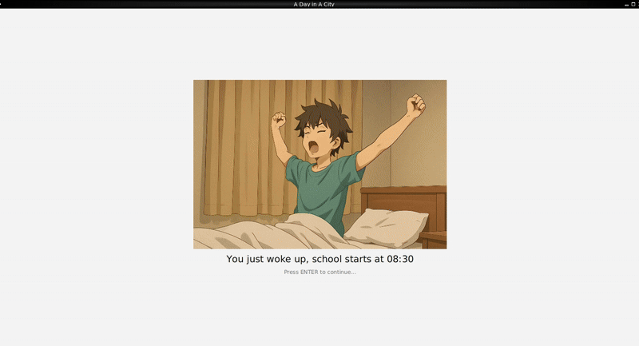

# Project Walkthrough
## 1.Project Overview - A Day in a City
This Java project simulate a normal day of a student (as of now) in a random location of the United States.
It is fun and engaging, and its main purpose is for entertainment. It uses real time data such as location from Geoapify and weather from Open Meteo for simulation. Then the program will display the different results from user's different choice of action. 

## 2.Code Breakdown
### Doc.sh
A list of codes used for starting the virtual display and remote connection to codespace to enable visible GUI on any browser that this codespace can execute.

### GameLogic.java
Main game logic, accessible to the Main class, used to execute game related activities and store game info.
    
    public void updateTime(int type)
\- Format the hour and minute by hour 

    public void addTime(int minute)
\- Add time to the current after execute some user action \
\- Format time after added

    public String getWeather()
\- Get stored weather based on current hour \
\- Get stored temperature based on current hour \
\- Check if the weather and temperatue in the future 24 hours for rain and snow \
\- Output for the check weather action in main 

    public void packBag()
\- This method is used to return check bag options to main \
\- It also generate the random event of user forgot to bring something \
\- It sets all items brought to true when the user decides to check the bag

    public String checkLateSchool()
\- This method is used to compare user's arrival time with school start time \
\- It returns a String telling the users if they are late or not

    public String weatherEvent()
\- This method will check current weather based on data from the Weather class \
\- Then the program will return the result of the weather with what the user has 

    public int getAge()
    public String getDate()
    public String getTime()
    public int getSchoolHour()
    public int getSchoolMinute()
    public ArrayList<String> getMorningThings()
    public int getReady()
    public int getHour()
    public int getMinute()
    public int getHappiness()
    public boolean isUmbrellaPack()
    public boolean isLunch()
    public boolean isTextbook()
    public boolean isHomework()
    public boolean[] getMorningStatus()
    public ArrayList<String> getAfternoonThings()
    public ArrayList<String> getParkThings() 
    public String getDestination()
    public int getHomeSchoolTravelTime()
    public int getSchoolParkTravelTime()
    public int getParkHomeTravelTime()
    public String getPreviousDestination()
    public ArrayList<String> getEveningThings()
    public int getHomeworkTime()
    public int getHomeworkDone()
    public boolean getDinner() 
    public boolean getShower()

\- List of getter methods \
\- Return needed information for Main

    public void setTime(int hour, int minute)
    public void setSchoolHour(int hour, int minute)
    public void setHappiness(int happiness)
    public void setUmbrellaPack(boolean umbrellaPack)
    public void setLunch(boolean lunch)
    public void setTextbook(boolean textbook)
    public void setHomework(boolean homework)
    public void setMorningStatus(int index, boolean status)
    public void setDestination(String destination)
    public void setPreviousDestination(String previousDestination)
    public void setHomeworkTime(int homeworkTime)
    public void setHomeworkDone(int homeworkDone)
    public void setDinner(boolean din)
    public void setShower(boolean shower)
\- List of setter methods \
\- Used to set specific data

### Main.java
This class initializes the JavaFX application, sets up the intro and game scenes, and starts the game when the user enters their name.

    public static void main(String[] args)
\- Main method \
\- Allow user to use debug to choose between console mode and GUI mode \
\- initialize the game components through API calls \
\- Runs the game

    public void start(Stage primaryStage)
\- Initialize the GUI stage \
\- Textbox that ask for user's name
\- Get transit time between home and school

    public void typeText(Label label, VBox vbox, String fullText, Duration delay, Runnable onFinished)
\- Display text in typewriter form \
\- Used for visual appealing

    public void handleMorningChoice(String action, String name, GameLogic game, Stage stage)
\- Used to direct scene for morning actions \
\- Used switch to differetiate between choices \
\- Also force a scene to prompt the user to exit home based on time

    public void notReady(Stage stage, String name, GameLogic game, int transitTime)
\- Display message for not-ready features

    public void showScene(Stage stage, String name, GameLogic game, String sceneID)
\- Display scene based on sceneID \
\- Gather information from gameLogic object \
\- Used images pregenerated that are stored in images folder \
\- Display text in typewriter format

    public void showScene(Stage stage, String name, GameLogic game, String sceneID, ArrayList<String> buttonsList)
\- Display choices \
\- Display buttons \
\- Show buttons with delay after one another

    public void yesNoOptions(Stage stage, String name, GameLogic game, String sceneID, String action)
\- This method handles user selection of two choices \
\- It takes in the sceneID and selection

    public void handleAfternoonChoice(String action, String name, GameLogic game, Stage stage)
\- Used to direct scene for afternoon actions \
\- Used switch to differetiate between choices \
\- Also force a scene to prompt the user to return home based on time

    public void handleEveningChoice(String action, String name, GameLogic game, Stage stage)
\- Used to direct scene for evening actions \
\- Used switch to differetiate between choices \
\- Also force a scene to prompt the user to eat dinner and shower based on time

### Map.java
This class deals with any location related API calls and storing data used for GameLogic class

    public static void getMap()
\- Generate a random longtitude and latitude \
\- Check and restrict the location to United States \
\- Store country info

    public static String findPlace(double latitude, double longitude)
\- Get country name by using BigDataCLoud API call 

    public static void findSchool()
\- Check school type \
\- Find matching school in near location \
\- Call schoolHelper to store data

    public static void schoolHelper(JSONArray features)
\- Find school that contains the type in the name and store its information \
\- If unable to find a school that contains the type in the name then default to first school. 

    public static int getTransitTime(double lat1, double long1, double lat2, double long2, String mode)
\- This method finds the transit time between two locations using two latitudes and longitudes with Geoapify API \
\- The default transit method is drive because public transits can't cover many places and causes long travel time \
\- Returns the time as int for minutes

    public static JSONObject getRequest(String urlString)
\- This method is a helper method used to get JSON info via https \
\- The JSONObject will be used for parsing info and insert to replace information for location

    public static void findPark()
\- This method finds a park near the random generated latitude and longitude from earlier \
\- This location data will be used to calculate travel time between places \
\- If no park can be found around the area, park will be initialized to "Leif Ericson Park"

    public static double getLatitude()
    public static double getLongitude()
    public static String getCountry()
    public static String getCity()
    public static String getState()
    public static String getSchoolName()
    public static String getSchoolAddress()
    public static String getSchoolType()
    public static double getSchoolLatitude()
    public static double getSchoolLongitude()
    public static double getParkLatitude()
    public static double getParkLongitude()
    public static String getParkName()

\- List of getter methods \
\- Return needed information for Main and GameLogic

    public static void setSchoolType(String type)
\- List of setter methods \
\- This one is used to set the school type to find using findSchool method

### Weather.java
This class deals with any weather related events by calling Open Meteo API to get the weather for the future 24 hours

    public static void findWeather()
\- This method finds the weather in the future 24 hours using Open Meteo API and store datas in arrays \
\- The data stored would be in int or double form representing the weather and temperature

    public static String defineWeather(int wCode)
\- This method takes in an int specifically from data gathered from findWeather method \
\- Then this method will return a String that represent the weather

    public static double getTemperature(int hour)
    public static int getWeather(int hour)
\- List of getter methods \
\- Specifically used for debug purposes

## 3.Features Implemented
✔ Base Project (88%) \
\- Uses an external API (Google Maps API) \
\- Uses multiple Java methods and logic \
\- Parses JSON response using basic string matching \
\- Provides interactive user experience via GUI and dialog \
\
✔ GUI (JavaFX) (+2%) \
\- Used scenes and stages to show the image and text for an event \
\- Used Buttons and ArrayList to construct user event selections \
\
✔ Filter/Sort Data (+2%) \
\- Time is filtered when executing the user selection scenes \
\- The user will be interrupted if a certain time was reached and prompted to do another action \
\
✔ Written Walkthrough (+5%) \
\- This document fulfills the walkthrough requirement
\

## 4. Output Example 
 

## 5. What I Learned
\- How to connect and retrieve data from external source \
\- How to parse a JSON file \
\- How to traverse through JSONArrays and JSONObject to get needed information \
\- How to utilize JavaFX
\- How to utilize GitHub codespace virtual display and remote desktop \
\- How to write scenes and make buttons for user interaction \
\- How to validate random coordinate for location within the country \
\- How to deal with case when data is not avaliable

